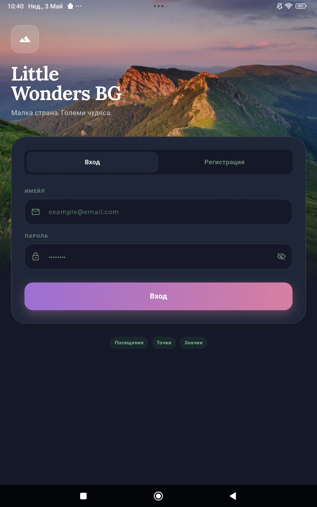
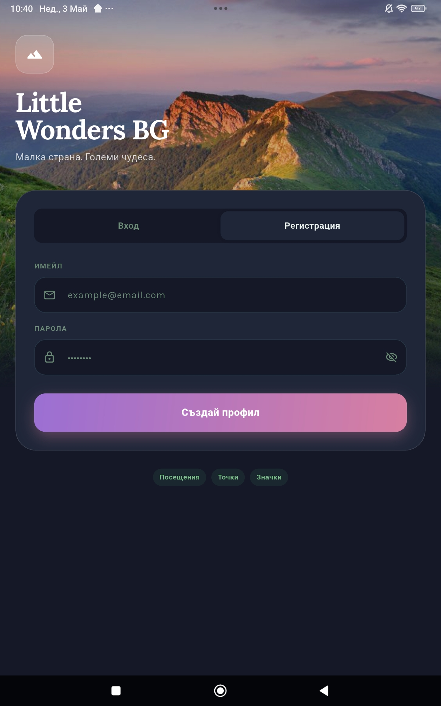
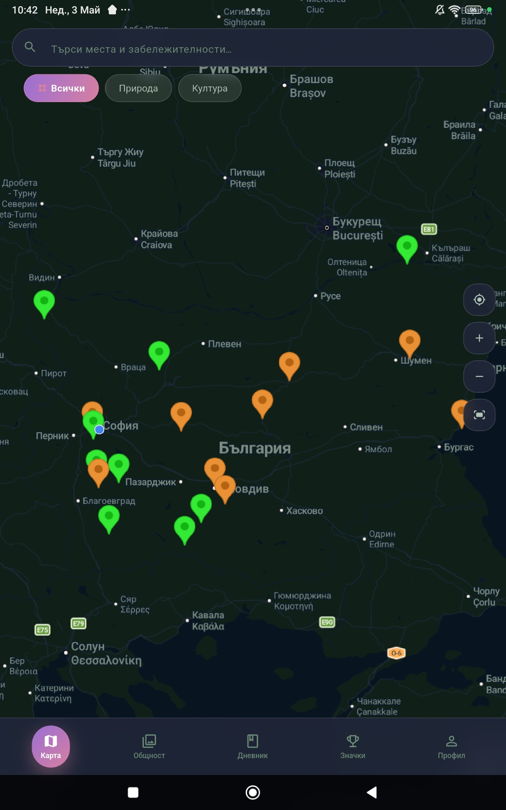
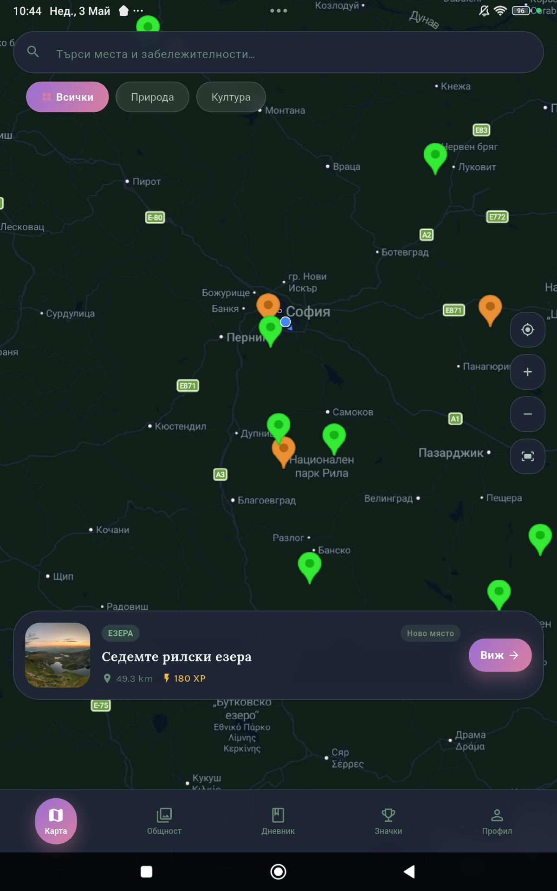
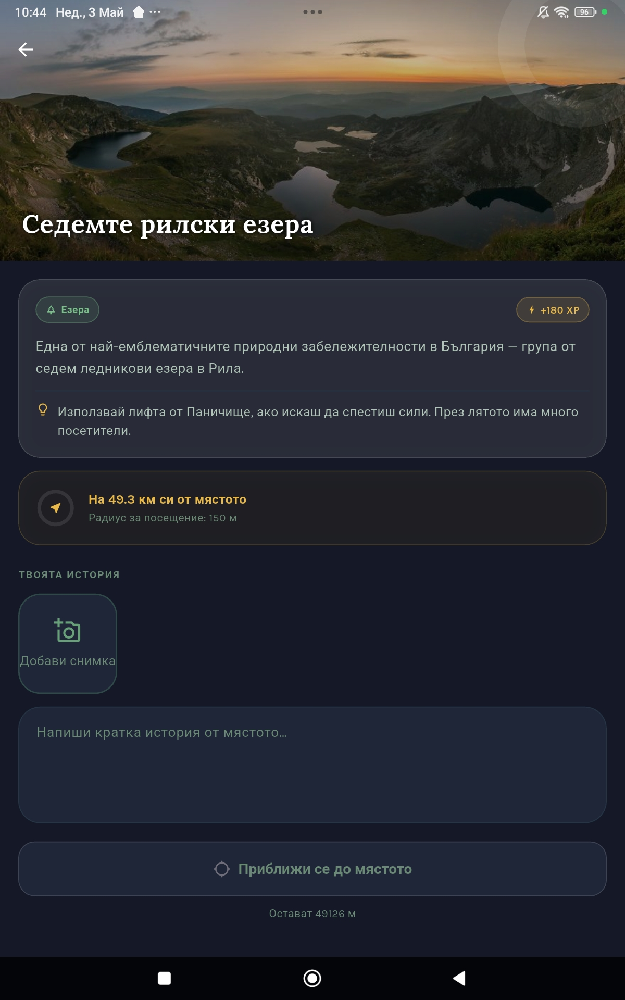
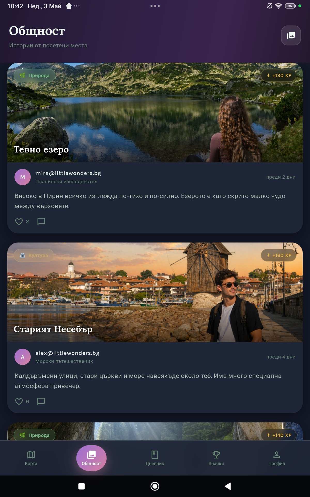
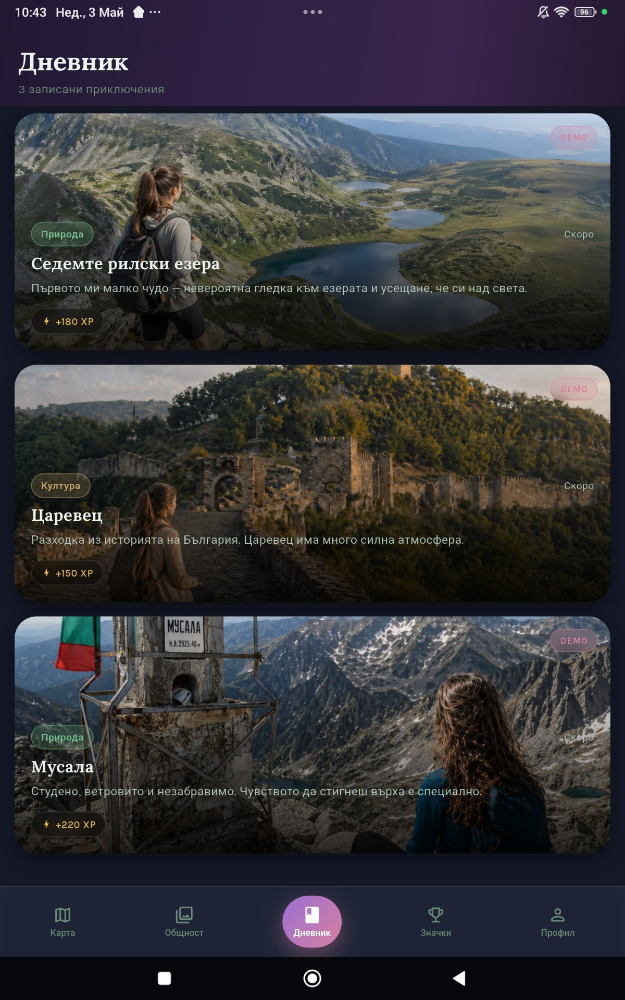
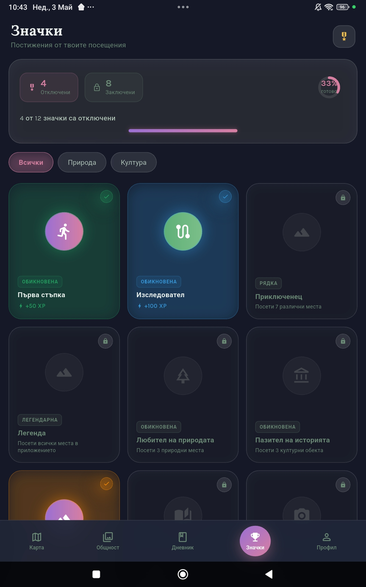
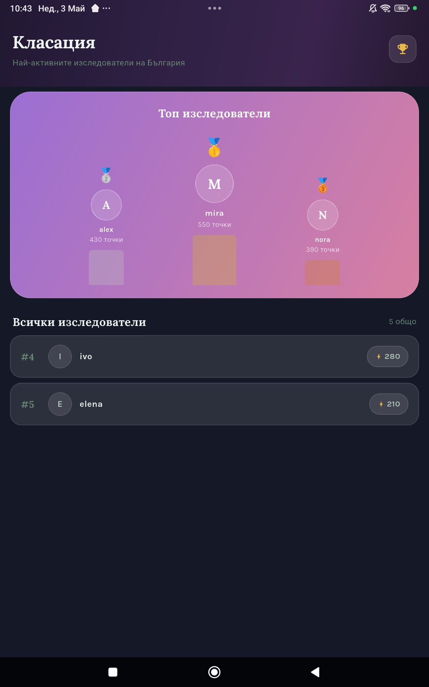
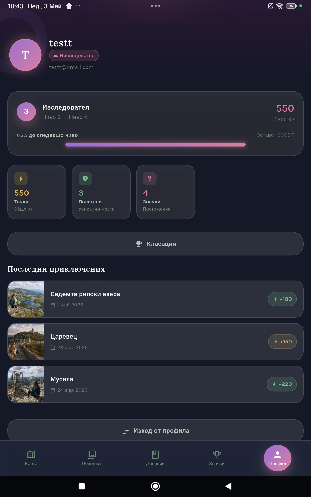

# Little Wonders BG / Summit Stories

Мобилно Flutter приложение за откриване, посещаване и споделяне на български природни и културно-исторически забележителности.

## Идея

Little Wonders BG насърчава потребителите да опознават България чрез интерактивна карта, туристически обекти, дневник на посещенията, система с точки, значки, нива, общност и класация.

## Основни функционалности

- Интерактивна карта с природни и културни забележителности
- Филтриране на обекти по категория
- Детайлен екран за всяко място
- GPS check-in при достигане на забележителност
- Добавяне на бележка и снимка чрез камера
- Дневник на посетените места
- Система с точки, нива и значки
- Профил с прогрес и последни приключения
- Общност с публикации, снимки, харесвания и коментари
- Класация на активните потребители

## Използвани технологии

- Flutter и Dart
- Riverpod за управление на състоянието
- Firebase Authentication
- Cloud Firestore
- Firebase Storage
- Hive за локално съхранение
- Google Maps Flutter
- Geolocator и Permission Handler
- Image Picker
- Cached Network Image

## Данни

Обектите в приложението се зареждат от локален JSON файл: `assets/pois.json`.

## Снимки от приложението
###  Вход и регистрация
| Вход | Регистрация |
|------|------------|
|  |  |

---

###  Карта и откриване на места

| Карта | Избрана локация |
|------|-----------------|
|  |  |

---

###  Детайли за място


---

###  Общност


---

###  Дневник на посещенията


---

###  Значки и постижения


---

###  Класация


---

###  Профил



## Стартиране

```bash
flutter pub get
flutter run
